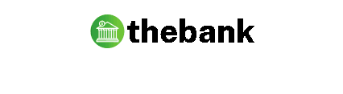
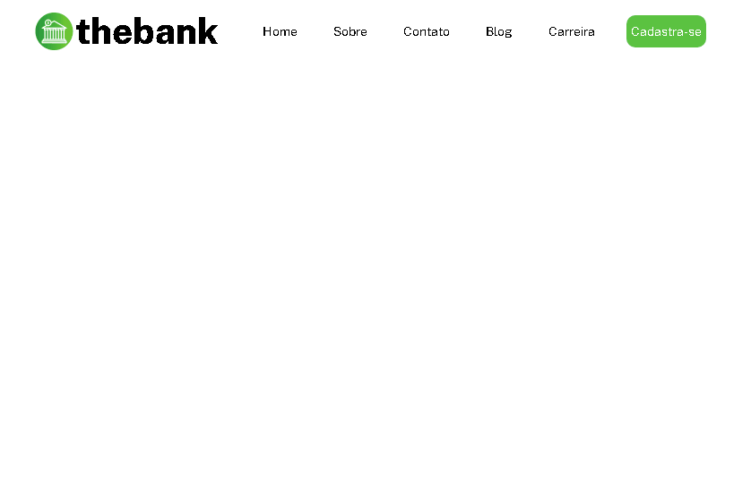

[]

# PROJETO DE ESTUDO USANDO FLEXBOX EM UM MENU RESPONSIVO </>

##  thebank

  

# DIFICULDADES PELO CAMINHO 🏁

 

Após algum tempo voltei a estudar programção e com isso venho buscando projetos para que eu possa aos poucos me aperfeiçoar em pontos que vejo que tenho dificuldade. Exemplo disso é a tão temida (ao menos para mim) responsividade dos sites.

 

Nesse caso em especifíco, esse projeto é do curso --DEV Quest--, dos gêmeos mais conhecidos da programação. O módulo de HTML e CSS avançado trás diversos desafios e um deles é esse.

 

O fato da didática ser bem simples e direta vem me ajudado a compreender e a lembrar de coisas que estudei durante meu curso técnico em T.I, por exemplo o uso do @media. Eu sinceramente não me recordo de ser mostrada no curso técnico e é algo que facilitou demais o entendimento para criar a responsividade. 

 

# TECNOLOGIAS USADAS 🛠

-   # HTML

-   # CSS
 

# RESPONSIVIDADE NA PRATICA 💻 📱

Por esse projeto é isso, estou aberto a feedbacks sobre o código que está disponivel no repositório e caso queira me mandar desafios para que eu possa treinar fique a vontade. Minhas redes sociais estão abertas também para isso. 🤙

